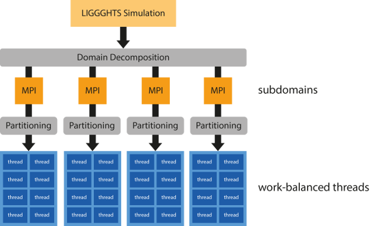
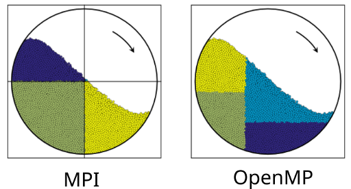
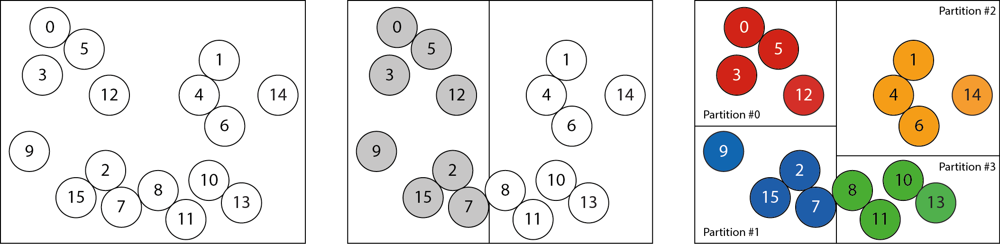

```
This is an academic adaptation of the LIGGGHTS software package, released by the
Department of Particulate Flow Modelling at Johannes Kepler University in Linz, Austria.
www.jku.at/pfm

This offering is not approved or endorsed by DCS Computing GmbH, the producer of the
LIGGGHTS® and CFDEM®coupling software and owner of the LIGGGHTS and CFDEM® trade marks.

LIGGGHTS - LAMMPS Improved for General Granular and Granular Heat
Transfer Simulations

LIGGGHTS is part of the CFDEMproject
www.liggghts.com | www.cfdem.com

Copyright 2009-2012 JKU Linz
Copyright 2012-2015 DCS Computing GmbH, Linz
Copyright 2013-     JKU Linz

LIGGGHTS is based on LAMMPS
LAMMPS stands for Large-scale Atomic/Molecular Massively Parallel
Simulator.

Copyright (2003) Sandia Corporation.  Under the terms of Contract
DE-AC04-94AL85000 with Sandia Corporation, the U.S. Government retains
certain rights in this software.  This software is distributed under
the GNU General Public License.
```
----------------------------------------------------------------------

# LIGGGHTS OpenMP Parallelization

This branch contains the first public release of the LIGGGHTS OpenMP parallelization
which was developed by Richard Berger (JKU Linz). It is the result of a
multi-year effort of restructuring LIGGGHTS to improve its efficiency and
quality. It was based on work in the USER-OMP package in LAMMPS by Axel
Kohlmeyer (Temple University).

The changes visible in this branch only make up a fraction of all the performed changes
that were necessary to enable this code. Many other changes have instead already been
contributed and released in the regular public releases of the software package.
E.g. a major portion of the [LIGGGHTS 3 structural changes](http://www.cfdem.com/node/42)
were in fact the by-product of this work. It was also one of the driving forces of
creating a [test harness](http://www.cfdem.com/liggghtsr-quality-assurance) and
introducing regular testing.

Due to LIGGGHTS's large code base, this prototype was only focussed on the
essential granular particle-wall and granular particle-particle interactions
and core algorithms such as integration, neighbor list building and contact
history. Along the way many smaller improvements were made, including:

* Refactorings to simplify the code base
* Reduction of algorithmic bottlenecks
* Reduction of MPI overheads

The **main benefit** of this OpenMP code is that it provides **automatic load-balancing**
of both particle-particle and particle-wall computations. It can also operate in
conjunction with MPI which allows it to run in a Hybrid MPI/OpenMP mode.



Even without the OpenMP parallelization, there are reports that some cases can run up
to twice as fast simply due to these other changes. So we invite you to try it out.
The following sections document the usage of this code.

**Table of Contents:**

* [Prerequisites](#prerequisites)
* [Installation](#installation)
  * [CMake Compilation (with OpenMP code)](#cmake-with-omp)
  * [CMake Compilation (with OpenMP code)](#cmake-without-omp)
  * [Classic Compilation (discouraged)](#classic-compilation)
* [Using Binaries created with CMake](#using-cmake-binaries)
* [OpenMP Tutorial Example](#openmp-example)
* [OpenMP Usage](#openmp-usage)
  * [Package OMP](#package-omp)
  * [Atom Style](#atom-style)
  * [Pair Styles](#pair-styles)
  * [Meshes](#meshes)
  * [Walls](#walls)
  * [Other Fixes](#other-fixes)
    * [Gravity](#gravity)
	  * [Integration](#integration)
  * [OpenMP Load-Balancing](#openmp-load-balancing)
    * [Passing Options to Zoltan](#zoltan-options)
    * [Load-Balancing using amount of neighbors as measure of work](#openmp-lb-neighbors)
	* [Technical Details (developers only)](#technical-details)
* [What is missing](#what-is-missing)

----------------------------------------------------------------------

<a name="prerequisites"></a>

## Prerequisites

* A C++11 and OpenMP >= 3 compliant compiler (e.g. GCC 4.8)

* Zoltan library (v3.6 or above)

	For load-balancing this code uses a third party library called Zoltan, developed by
	Sandia National Laboratories. It can be downloaded
	[here](http://www.cs.sandia.gov/Zoltan/). To install it on your system untar the
	source code and follow these instructions:

	```bash
  mkdir BUILD
  cd BUILD
  ../configure
  make everything
  make install
	```

	For more details please refer to their [documentation](http://www.cs.sandia.gov/Zoltan/ug_html/ug.html).

<a name="installation"></a>

## Installation

There are two ways of compiling this LIGGGHTS version. The classic method of using a
customized Makefile and a newer (recommended) way of using CMake.

<a name="cmake-with-omp"></a>

### CMake Compilation (with OpenMP code)

The benefit of using CMake is that it works on more platforms and it can automatically
detect the paths of required libraries. E.g. on Linux it will find the VTK library if
it is installed. For convenience a CMake script was added to detect your Zoltan
installation. Therefore once Zoltan is installed, the following steps should be
sufficient:

1. Activate OpenMP code and Zoltan additions

	```bash
  cd src
  make yes-USER-OMP
  make yes-USER-ZOLTAN
  cd ..
	```

2. Configure using CMake

	```bash
	mkdir src-build
  cd src-build
  cmake ../src -DUSE_OPENMP=on
	```

3. Compile using Make

	Serial compilation:
	```bash
	make
	```

	Parallel compilation (e.g. 4 processes):
	```bash
	make -j 4
	```

	Note that unlike previous LIGGGHTS-PUBLIC compilations, this will not create
	one big binary file. Instead it creates a small `liggghts` executable and a
	shared library libliggghts.so which contains the majority of functionality.

4. Installation (optional)

	To install the generated LIGGGHTS binary and shared library to a specific location,
	an installation prefix can be defined during CMake configuration. E.g.

	```bash
	cmake ../src -DUSE_OPENMP=on -DCMAKE_INSTALL_PREFIX=/opt/liggghts-omp/
	```
	Using this configuration, compile using make and install to the target location using

	```bash
	make install
	```

<a name="cmake-without-omp"></a>

### CMake Compilation (without OpenMP code)
As mentioned, even without the OpenMP code there are some improvements which can be
used with MPI only runs. The compilation of such a binary using CMake only changes
slightly:

1. Make sure the OpenMP code is disabled

	```bash
	cd src
  make no-USER-OMP
  make no-USER-Zoltan
  cd ..
	```

2. Configure using CMake

	```bash
	mkdir src-build
  cd src-build
  cmake ../src
	```

3. Compile using Make

	Serial compilation:
	```bash
	make
	```

	Parallel compilation (e.g. 4 processes):
	```bash
	make -j 4
	```
4. Installation (optional)

	To install the generated LIGGGHTS binary and shared library to a specific location,
	an installation prefix can be defined during CMake configuration. E.g.

	```bash
	cmake ../src -DCMAKE_INSTALL_PREFIX=/opt/liggghts/
	```
	Using this configuration, compile using make and install to the target location using

	```bash
	make install
	```

<a name="classic-compilation"></a>

### Classic Compilation (discouraged)

For historic reasons, there is also a classic LIGGGHTS Makefile "hybrid" to compile it
the old way. This will create one large binary called `lmp_hybrid`. Before compilation
the file `MAKE/Makefile.hybrid` has to be edited manually to correct any library
installation paths.

```bash
cd src
make yes-USER-OMP
make yes-USER-ZOLTAN
make hybrid
```

<a name="using-cmake-binaries"></a>

## Using Binaries created with CMake
Compilation using CMake generates the `liggghts` executable binary and shared library
`libliggghts.so`. In order to execute the `liggghts` binary, it must be able to find the
shared library using the dynamic loader of your system.

If the compiled binary is used directly from the build directory (e.g. `src-build`),
both files will be located in the same directory. The dynamic loader on most Linux
systems will therefore find it automatically.

If the compiled result is installed to an `$INSTALL_PREFIX` directory using
`make install`, the files will be separated into `bin/` and `lib/` subdirectories.
In order to use the binary in this case, the `$INSTALL_PREFIX/bin` should be prepended
to the `PATH` enviroment variable and `$INSTALL_PREFIX/lib` to the `LD_LIBRARY_PATH`
environment variable.

```bash
export PATH=$INSTALL_PREFIX/bin:$PATH
export LD_LIBRARY_PATH=$INSTALL_PREFIX/lib:$LD_LIBRARY_PATH
```
<a name="openmp-example"></a>

## OpenMP Tutorial Example

A tutorial example of using the OpenMP parallelization can be found in the
`examples/LIGGGHTS/OMP/rotaryKiln` directory. It illustrates the basic usage of all
necessary commands and contains both a MPI-only and OpenMP versions of input scripts.

The following figure illustrates how an static MPI decomposition with 4 processes
might look like in this case. Due to this geometry, one of the MPI processes
would not be processing any particles and be idle. Instead the OpenMP
implementation can adjust dynamically and find an optimal distribution of
particles among 4 threads.

Through this - depending on the used 4 MPI decomposition - the OpenMP performs
25-50% better than the MPI-only code.



<a name="openmp-usage"></a>

## OpenMP Usage
A OpenMP-enabled version of LIGGGHTS supports additional styles and fixes which all
end with an additional `/omp` suffix. The following sections document the changes
necessary for any LIGGGHTS script to utilize the OpenMP parallelization.

<a name="package-omp"></a>

### Package OMP

Prior to using any OpenMP styles or fixes, one must enable OpenMP by using
the `package` command. This will enable OpenMP versions of core algorithms such
as neighbor list building.

```
package omp * force/neigh
```

Using this command LIGGGHTS will determine the number of OpenMP threads
by looking for the `OMP_NUM_THREADS` environment variable. This is
the default OpenMP behaviour. However this can be overruled by
setting the number of threads directly in the `package` command.
E.g., for 4 threads:

```
package omp 4 force/neigh
```

This implementation also includes a capability for thread-binding.  There are
two additional options for this reason: `thread-binding` and `verbose`.

```
package omp * force/neigh thread-binding verbose
```

The `thread-binding` option will force each thread to be bound to a CPU core
using SMP-style numbering. This means that it assumes that cores which are
next to each other are numbered with consecutive numbers.

The `verbose` option can be used to report the final thread affinity settings.

This capability was developed prior to the general availability of OpenMP 4
in common compilers. Since OpenMP 4 now includes a rich set of options for
controlling thread placement, the custom thread-binding code will have
become obsolete.

Note that on larger clusters a combination of MPI process-binding and OpenMP
thread-binding options will be needed for best performance.

<a name="atom-style"></a>

### Atom Style
The OpenMP parallelization requires the atom style `sphere/omp` or `granular/omp`.

```
atom_style sphere
```
becomes:
```
atom_style sphere/omp
```

<a name="pair-styles"></a>

### Pair Styles
All granular pair styles have a OpenMP implementation. To select them simply use
`gran/omp` instead of `gran` as `pair_style`.

```
pair_style gran model hertz tangential history
```
becomes:
```
pair_style gran/omp model hertz tangential history
```

<a name="meshes"></a>

### Meshes
Meshes of type `mesh/surface` which are used by a wall fix are required to be replaced
by their OpenMP version of `mesh/surface/omp`.

```
fix cadMesh all mesh/surface file meshes/Mixer.stl type 1
```
becomes:
```
fix cadMesh all mesh/surface/omp file meshes/Mixer.stl type 1
```

<a name="walls"></a>

### Walls

Walls of type `wall/gran` should be replaced by their OpenMP version of `wall/gran/omp`.

```
fix meshes all wall/gran model hertz mesh n_meshes 1 meshes cadMesh
```
becomes:
```
fix meshes all wall/gran/omp model hertz mesh n_meshes 1 meshes cadMesh
```

<a name="other-fixes"></a>

### Other Fixes

The implementation of the OpenMP parallelization is not feature complete.
Some fixes might not even need an OpenMP version at all. Here is a list of other
fixes which have been optimized so far.

<a name="gravity"></a>

#### Gravity
The `gravity` fix should be replaced by `gravity/omp`.

```
fix gravi all gravity 9.81 vector 0.0 0.0 -1.0
```
becomes:
```
fix gravi all gravity/omp 9.81 vector 0.0 0.0 -1.0
```

<a name="integration"></a>

#### Integration
The `nve/sphere` integration fix should be replaced by `nve/sphere/omp`.

```
fix integr all nve/sphere
```
becomes:
```
fix integr all nve/sphere/omp
```

<a name="openmp-load-balancing"></a>

### OpenMP Load-Balancing

Pair styles and wall fixes operate on load-balanced partitions of particle data.
Each OpenMP thread operates on one of these partitions.

By default LIGGGHTS will use a static schedule of work.
This means that all particles are evenly split up among all threads without
taking any geometric or workload information into account. In general this will
therefore lead to an unbalanced workload among threads.

Load-balancing is enabled by selecting the Zoltan partitioner using the
`partitioner_style` command.
```
partitioner_style zoltan
```
This partitioner will dynamically generate particle partitions during runtime
using the Recursive Coordinate Bisection (RCB) algorithm.



<a name="zoltan-options"></a>

#### Passing Options to Zoltan

Key-Value pairs passed as arguments to the
`partitioner_style zoltan` command are passed through to the Zoltan library and
can be used to tune Zoltan.

```
partitioner_style zoltan RCB_REUSE 1
```

<a name="openmp-lb-neighbors"></a>

#### Load-Balancing using amount of neighbors as measure of work
By default the Zoltan RCB algorithm will try to create partitions with equal
amounts of particles in them. For better load-balancing each particle can be
given a weight proportional to its workload. Zoltan will then try to balance
these weighted particles between partitions. In the current implementation the
weight of a particle is computed based on its number of neighbors. This is good
quick approximation of the expected workload during particle-particle
interactions. To enable this feature, use the following Zoltan options:

```
partitioner_style zoltan OBJ_WEIGHT_DIM 1
```

<a name="technical-details"></a>

#### Technical Details (developers only)
RCB can be further tuned by passing options to Zoltan. By default, the Zoltan
partitioner uses the following options:

| Option                 | Default Value  | Description                                                                          | Note                           |
|:-----------------------|:---------------|:-------------------------------------------------------------------------------------|:-------------------------------|
| DEBUG_LEVEL            | 0              | Controls Debug output                                                                |                                |
| LB_METHOD              | RCB            | Selection of RCB as partitioning algorithm                                           |                                |
| NUM_GID_ENTRIES        | 1              | number of global IDs per element                                                     | DO NOT CHANGE                  |
| NUM_LID_ENTRIES        | 1              | number of local ids per element                                                      | DO NOT CHANGE                  |
| NUM_LOCAL_PARTS        | *# of threads* | number of partitions generated. this should always be equal to the number of threads | DO NOT CHANGE                  |
| RETURN_LISTS           | PARTS          | tells Zoltan to return a list containing the mapping of particles to parts           | DO NOT CHANGE                  |
| KEEP_CUTS              | 1              | Zoltan should keep information of past partitionings                                 | DO NOT CHANGE                  |
| RCB_REUSE              | 0              | Zoltan should use past partitioning information for repartitioning                   | **Recommended to set to 1**    |
| RCB_OUTPUT_LEVEL       | 0              | RCB specific debug output                                                            |                                |
| RCB_RECTILINEAR_BLOCKS | 0              | RCB specific option                                                                  |                                |
| OBJ_WEIGHT_DIM         | 0              | number of dimensions in weight vector of element                                     | **Set to 1 for work balance ** |

**Please note that these options are provided in full detail for advanced users only.**
Options marked as "DO NOT CHANGE" usually indicate a limitation in the implementation.
Since Zoltan requires implementators to provide certain callbacks, changing some
options might require code changes.

Additional information about RCB Load-Balancing and options can be found
[here](http://www.cs.sandia.gov/zoltan/ug_html/ug_alg_rcb.html).

<a name="what-is-missing"></a>

## What is missing

In our [Powder Technology paper (2015)](http://www.sciencedirect.com/science/article/pii/S0032591015002144)
we mention the use of a MPI Load-Balancing strategy which is present in LIGGGHTS.
Together these two parallelization strategies allow to get the best of both worlds.
However, as of now, this MPI Load-Balancing has not been put into the public
domain by DCS yet. While it has found its way back to LAMMPS, there are additional
changes which are necessary for Mesh support. The development of such capabilities
costs time and money, which is why this is still considered a *premium* feature.
